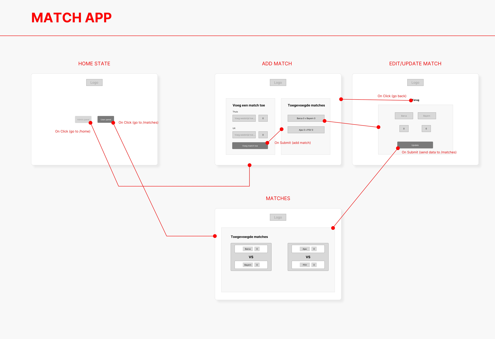
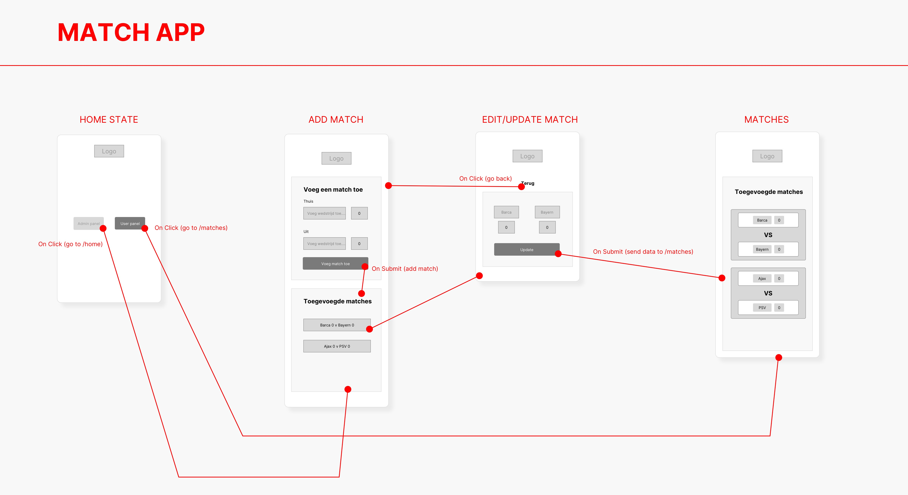

# Browser Technologies


https://browsertech-cmd.herokuapp.com/
## Description
Voor het vak Browser Technologies gaat het voornamelijk over progressive ehancement. Hoe kunnen wij het web beter maken voor iedereen. Niet alleen de mensen op de jusite devices en browsers. Nee de mensen zonder die fancy dingen moeten ook een goede experience krijgen. Voor dit vak kon je kiezen uit verschillende cases. Zelf ben ik gegaan voor de case van het scoreboard. Dit leek mij wel een leuke en uitdagende case (dat was het ook). Aan deze case werk je tot het vak klaar is. De app die je bouwt moet kunnen werken met de verschillende lagen (functional/reliable, usable & pleasurable), maar ook zonder deze lagen moet jou app het goed kunnen doen. Een leuke challenge voor deze 3 weken!

## Wireflows (Mobile & Desktop)




## Functional/reliable, Usable & Pleasurable.


## Features/Browser Tech used
Ik heb voor mijn app de @support gebruikt in mijn CSS. Mijn app maakt niet echt gebruik van client side JS, persoonlijk omdat ik dit niet nodig vind voor nu en de app zonder ook prima werkt. Maar de @support gebruik ik wel en vooral voor flexbox. Want soms kan dat niet overal werken. Ook maak ik gebruik van Grid (grid is nog minder ondersteund dan flexbox). Door even een tijdje rond gekeken te hebben op caniuse merkte ik dat het toch slim was dus om een fallback te bouwen. Ik heb mijn app eerst opgebouwd met oude vertrouwde code (float, position etc.) en daarna in @support heb ik flex en grid toegevoegd. Mijn app is niet erg ingewikkeld qua CSS dus dit was niet heel erg om om te bouwen. Het is wel tof om te zien dat @support zo goed werkt en het is ook handig om te weten dat die functie bestaat binnen CSS.


## Tested in 4 browsers
Ik heb de app in 4 browsers getest. 2 op mijn Macbook, 1 op mijn iPhone en dan 1 op een andere android telefoon. Hieronder een lijst met de browsers per device

**Macbook**
- Safari (versie: 15.3)
- Chrome (versie: 99.0.4844.84)

**iPhone**
- Safari (versie: 15)

**Nokia Lumia**
- Internet Explorer (versie: niet bekend)

**PS5**
- Sony browser (versie: niet bekend)

## Test results

**Macbook - Safari**
Ik heb in het begin mijn CSS en JS aangelaten. Kijken of ik gelijk al wat tegen kom. De knoppen om de score aan te passen waren wat onduidelijk en te klein. Hierdoor kon je ernaast klikken. Voor de rest werkt het gewoon prima. Nu zonder CSS en JS. Het werkt nog wel goed, geen hevige problemen. De hierachie is duidelijk. Je ziet soms alleen even niet echt meer waar je zit. Dit kan wat duidelijker. Maar voor de rest werkt het echt prima.

**Macbook - Chrome**
Weer eerst CSS en JS aan, daarna zet ik dit uit. Iets ander bugs, maar niet drastisch. Weer de number input dit misschien wat vaag kan ogen. Voor de rest werkt het prima. Geen verschil nu met Safari als ik de CSS en JS uitzet. Dat is mooi, want als je app op een andere browser zich anders gedraagt dan is dat niet prettig. Je wilt zoveel mogelijk de zelfde experience op alle browsers. 

**iPhone - Safari**
Ik heb de app getest op de iPhone via Safari. Hij werkt hier prima in, toch mis je qua design wat dingen om de user experience te verbeteren. Vooral dat je nog moet scrollen om andere content te zien. Ik heb ook JS uitgezet, maar dit werkt niet echt anders dan de Macbook.

**Nokia Lumia - Internet Explorer**
Ook hier werkt de app prima, natuurlijk ziet het misschien er iets anders uit dan de iPhone. Dat is wel het verschil tussen een telefoon van 2020/21 en eentje die paar jaar ouder is. Maar de app werkt goed, geen grote problemen of bugs. Ik kon hier niet echt vinden hoe ik de CSS of JS kon uitzetten, dus dit heb ik niet echt kunnen testen.

**PS5 - Sony browser**
Als laatste de PS5, dit was ook het device wat ik toegewezen gekregen had. Hij werkt hier prima op, alleen zullen een paar kleine dingen weg vallen. Zo werken emoji's niet en andere custom dingen zoals arrows die via deze manier ingeladen worden (&#10094;). Toch werkt hij ook hier prima en kun je alles gewoon doen zonder hevige bugs. Daar was ik wel blij mee. 


## Reflectie
Ik ben erachter gekomen wat een bugs sommige websites nog hebben als je wat lagen weg gaat halen. Ook is het echt nog een klus om je website progressive ehancement proof te maken. Toch heb ik in deze 3 weken enorm veel geleerd. In het begin klonk het wat saai, maar ik vond het super interessant en leuk om mee bezig te zijn. Het is jammer dat we maar 3 weken hadden, ik had graag nog meer tijd erin gestoken om echt nog iets beters te maken. Toch heb ik mijn best gedaan voor die 3 weken en ben ik trots op mijn eindproduct. Ik ga zeker meer nadenken ook over progressive ehancement als ik aan andere projecten ga werken (ook buiten school).

## Table of Contents

- [Install](#install)
- [Features](#features)
- [Used Tools](#used-tools)
- [Meta](#meta)
- [License](#license)

## Install

Clone the GitHub Repo locally
```
git clone https://github.com/DaanKetelaars/BT-Eindopdracht
```

Install all packages
```
npm install
```

Host this project on localhost. 
```
PORT = 8081
```

## Used Tools

- [git](https://git-scm.com/)
- [json](https://www.json.org/json-en.html)
- [NodeJS](https://node.jshttps://nodejs.org)
- [ExpressJS](https://expressjs.com/)

## Meta
For any questions, don't hesitate to reach out!
Daan Ketelaars - daanketelaars@gmail.com - https://github.com/DaanKetelaars/BT-Eindopdracht

## License

Usage is provided under the [MIT License](https://github.com/git/git-scm.com/blob/master/MIT-LICENSE.txt) MIT. See [LICENSE](https://github.com/DaanKetelaars/BT-Eindopdracht/blob/master/LICENSE) for the full details.


